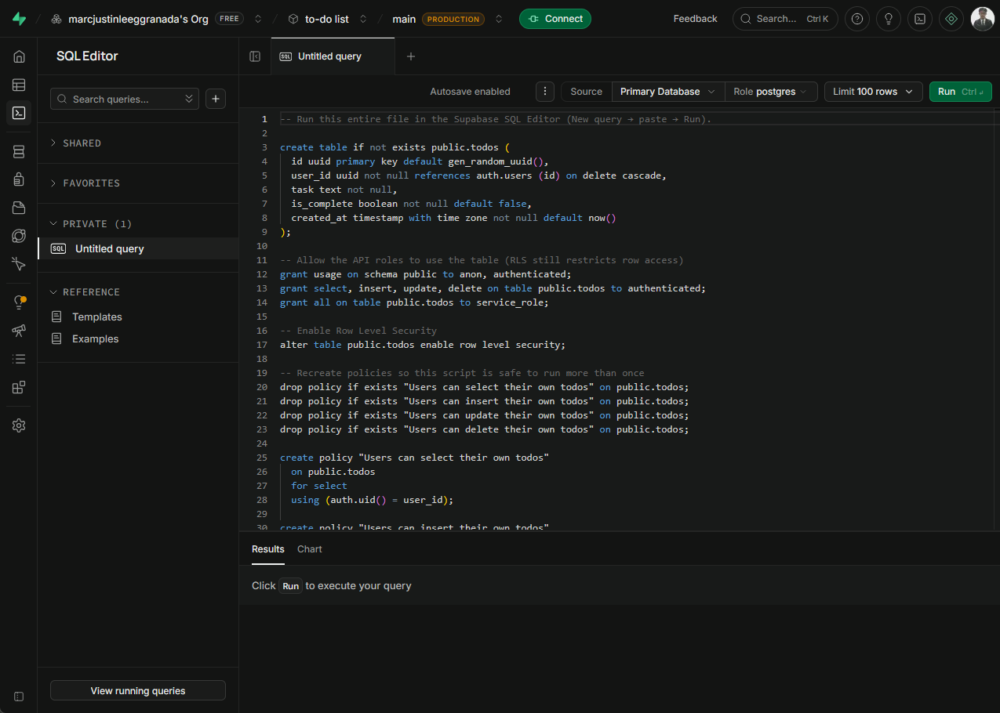
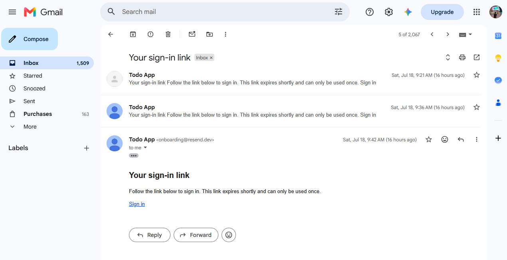
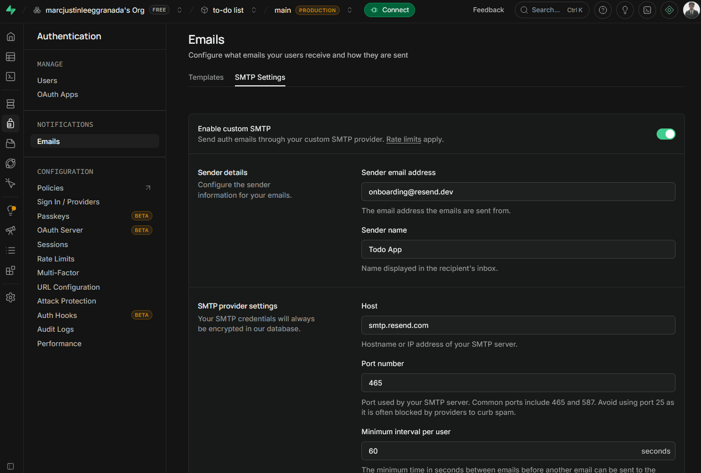
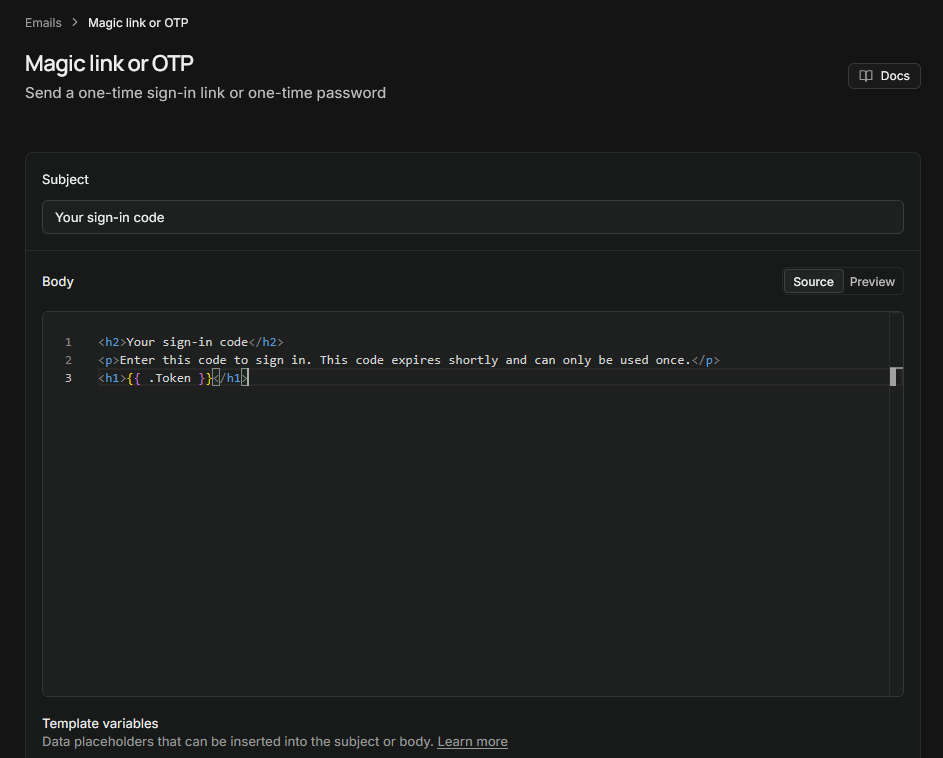
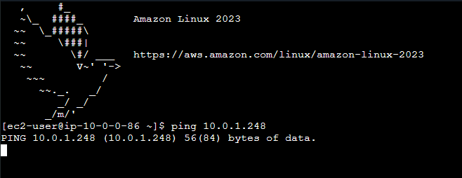
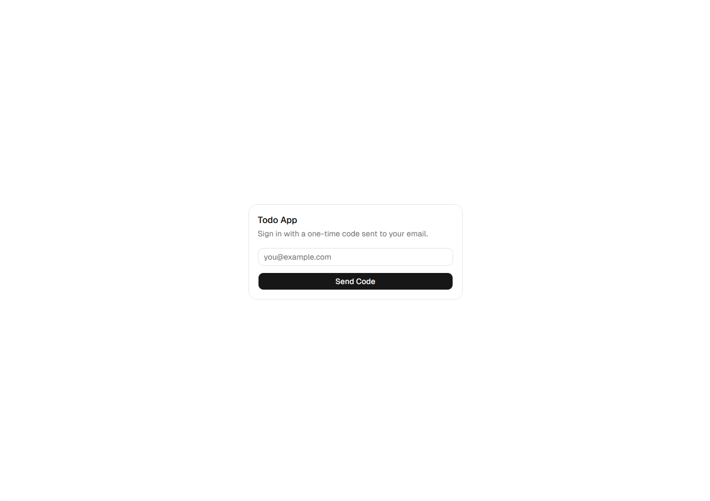
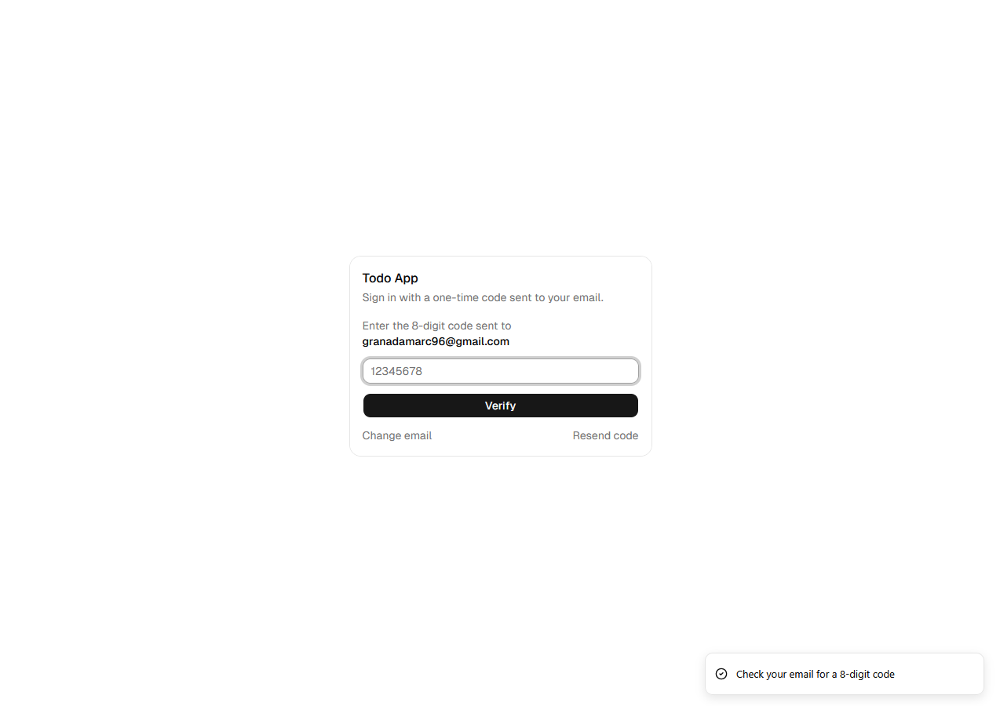
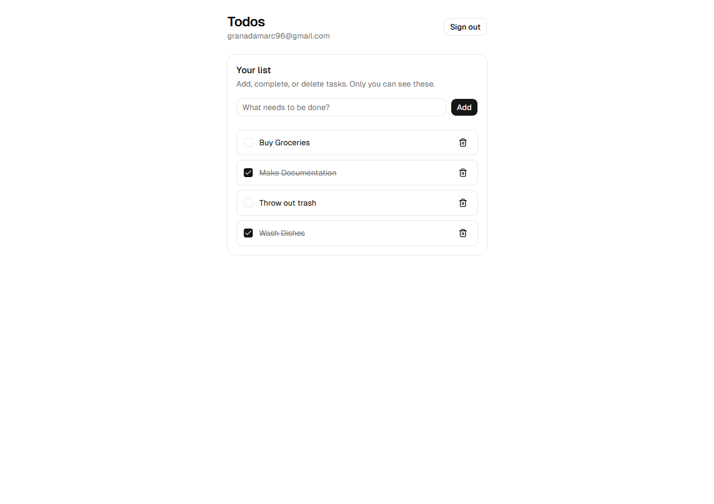
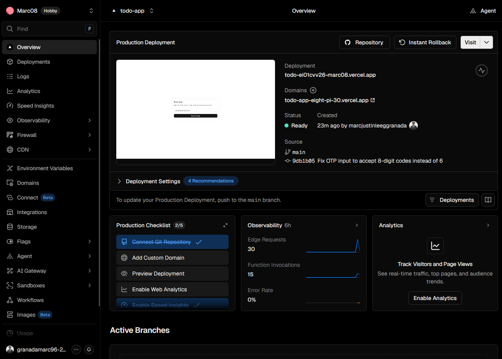
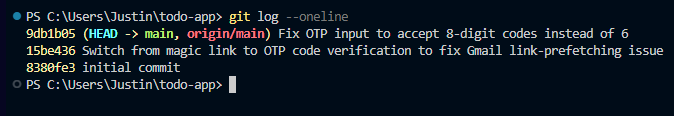

# Deploying a Full-Stack Todo App: A Learning Project
 
**Stack:** Next.js · Supabase · Vercel · shadcn/ui · Resend
**Repo:** [github.com/marcjustinleeggranada/Todo-App](https://github.com/marcjustinleeggranada/Todo-App)
**Live app:** todo-app-eight-pi-30.vercel.app
 
## Why I Built This
 
I wanted to try my hand at actually deploying a website end-to-end, rather than just building something that runs on `localhost`. I picked a stack that comes up constantly in modern web development — Next.js, Supabase, Vercel, and shadcn/ui — and built the simplest possible project that still touches all of it: a to-do list with real user authentication.
 
I used Cursor AI to write the code, but the debugging, the dashboard configuration, the environment variable wrangling, and the actual problem-solving were mine. This document is a record of that process — what worked immediately, and more usefully, what didn't.
 
## What the App Does
 
A minimal to-do list where:
- Users sign in via a one-time code sent to their email (no passwords)
- Each user only sees their own tasks — enforced at the database level, not just hidden in the UI
- Tasks can be added, marked complete, and deleted
That's it. No categories, no due dates, no sharing. The simplicity was intentional — the point was to get *all four* pieces of the stack talking to each other correctly, not to build something feature-rich.
 
## The Stack, and Why Each Piece Is There
 
| Tool | Role in this project |
|---|---|
| **Next.js** | App framework — pages, routing, server/client components |
| **Supabase** | Database (Postgres) + authentication, with Row Level Security controlling data access |
| **Vercel** | Hosting and deployment |
| **shadcn/ui** | Pre-built, accessible UI components (buttons, inputs, cards, toasts) |
| **Resend** | Email delivery for login codes, once Supabase's built-in email sending proved too limited |
 
### Database setup
 
The entire schema is one `todos` table, with Row Level Security enabled so a user can only read or write rows where `user_id` matches their own authenticated ID — enforced by Postgres itself, not just application logic.
 

 
### Project structure
 

 
## The Struggles (a.k.a. the Actual Learning)
 
Almost nothing about this project went wrong in a way I expected. The struggles were mostly about *auth email delivery* — a part of the stack I assumed would just work out of the box.
 
### 1. Magic links silently failing (Gmail link-prefetching)
 
The original design used Supabase's default magic-link login: click a link in your email, get signed in. In testing, the link would authenticate — but only sometimes. Other times, clicking it returned a `403: One-time token not found` error, even on a link I'd never clicked before.
 
The cause: Gmail (and several other providers) automatically "visits" links in incoming emails as a security scan, before the user ever clicks them. That visit consumes the one-time token, so by the time I actually clicked the link, it was already dead.
 

 
**Fix:** switched the entire login flow from a clickable magic link to a 6-digit (later 8-digit — more on that below) code the user types in manually. No link, nothing for an email scanner to prefetch, no silent token burn.
 
### 2. Supabase's default email sending is rate-limited
 
Even after fixing the token issue, Supabase's built-in email service turned out to be quite restrictive on the free tier — not suitable for repeated testing during development, let alone real use. The fix here was to configure a custom SMTP provider instead of relying on Supabase's default mailer.
 
I connected **Resend** as the SMTP provider. The tradeoff: without a verified custom domain, Resend's sandbox mode only delivers emails to the address used to create the Resend account itself — meaning right now, this app can only send login codes to my own email. Good enough for a personal project; a real domain would be the next step for anything used by other people.
 

 
### 3. Right idea, wrong template
 
Even with SMTP working, the email was *still* sending a clickable link instead of a code. Supabase splits email logic into multiple templates depending on context — "Magic Link or OTP" is used for returning users, but a *first-time* sign-in (which every test technically was, since I kept using the same test flow) fires the separate **"Confirm sign up"** template instead. I'd correctly edited the first template and never touched the second.
 
The fix, once identified, was straightforward: swap `{{ .ConfirmationURL }}` for `{{ .Token }}` in the template that was actually firing.
 

 
### 4. Environment variables silently mismatched on Vercel
 
The deployed site threw `Your project's URL and API key are required to create a Supabase client!` — despite everything working fine locally. The cause, once traced: Supabase's dashboard now labels what used to be called the "anon key" as the **"publishable key."** I'd copied it under that newer name into Vercel, but the app's code was still reading `process.env.NEXT_PUBLIC_SUPABASE_ANON_KEY` — a name that no longer existed in the environment. Same key, different label, silently broken.
 

 
**Fix:** deleted the mismatched variable and re-added it under the exact name the code expected, then redeployed.
 
### 5. The code was 8 digits, the input only accepted 6
 
A smaller, funnier bug to close things out: Supabase's OTP codes turned out to be 8 digits by default, but the sign-in form — built assuming the more common 6-digit convention — silently capped input at 6 characters. Codes couldn't even be pasted in full.
 
Fixed by pulling the character limit into a single constant (`OTP_LENGTH = 8`) instead of hardcoding it in multiple places, so it's a one-line change if this ever needs adjusting again.
 
## The Result
 
A working sign-in flow with no passwords, a functioning todo list scoped per-user, and a live deployment.
 
| Sign in | Enter code | Working app |
|---|---|---|
|  |  |  |
 
Deployed and live on Vercel:
 

 
The commit history tells the same story as this document, just in fewer words:
 

 
## Reflection
 
Every actual problem in this project came from the gap between "the code compiles" and "the service is configured correctly" — mismatched variable names, the wrong email template firing, an assumption about digit count that didn't hold. None of it was a coding problem in the traditional sense; all of it was integration and configuration, which is arguably the more realistic skill for working with real infrastructure.
 
This was a project driven mostly by curiosity rather than a specific need, and deliberately scoped to be as simple as possible. That was the right call — it let the actual friction points (auth, environment configuration, deployment) surface clearly instead of getting lost in feature complexity. For more serious projects going forward, I now have a working mental model of how these four pieces fit together, and — more importantly — what tends to go wrong when they don't.
 
